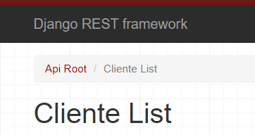

# CLIENTES_API_DJANGO

Api en Django_rest_framework  

Se creo models.py una class CLiente los campos

Se serializaron en el archivo serializer.py  

Y se devulve a la view para ser enviado a urls.py y realizar las peticiones correspodientes 

Documentacion https://api-clientes-django.onrender.com/clientes/docs/ 

 

Clonar repositorio  

git clone https://github.com/davis45368/CLIENTES_API_DJANGO.git 

 

Instalar requirements 

pip install –r requirements.txt

 

@python version 3.11.1 
